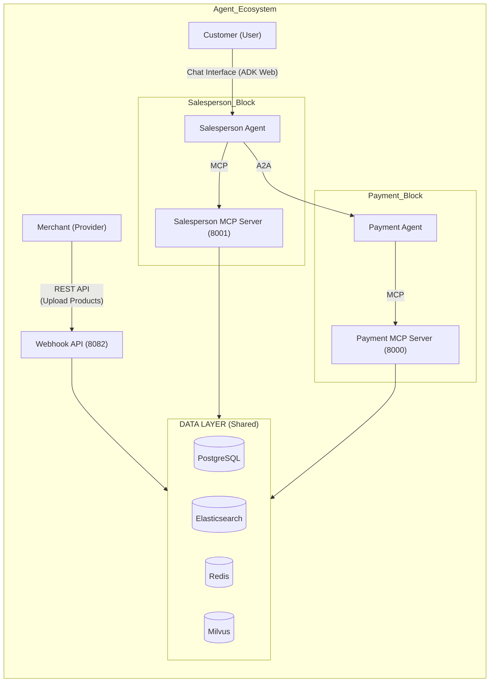
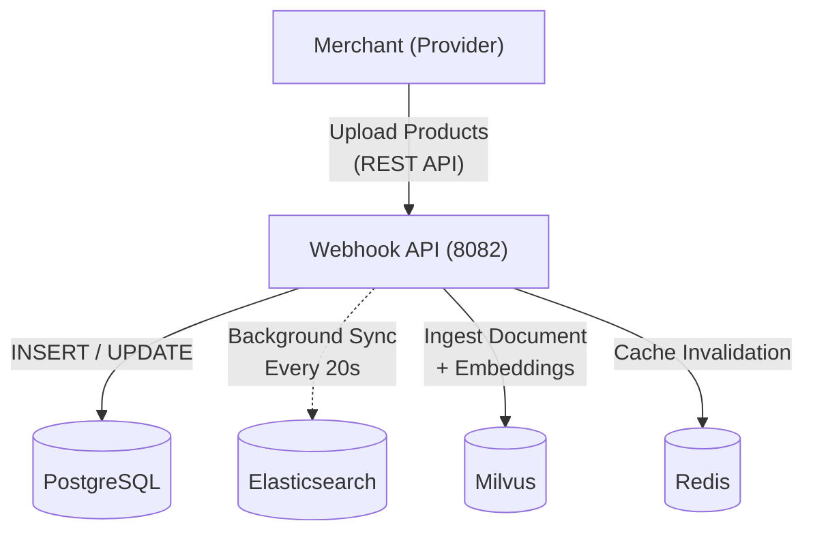
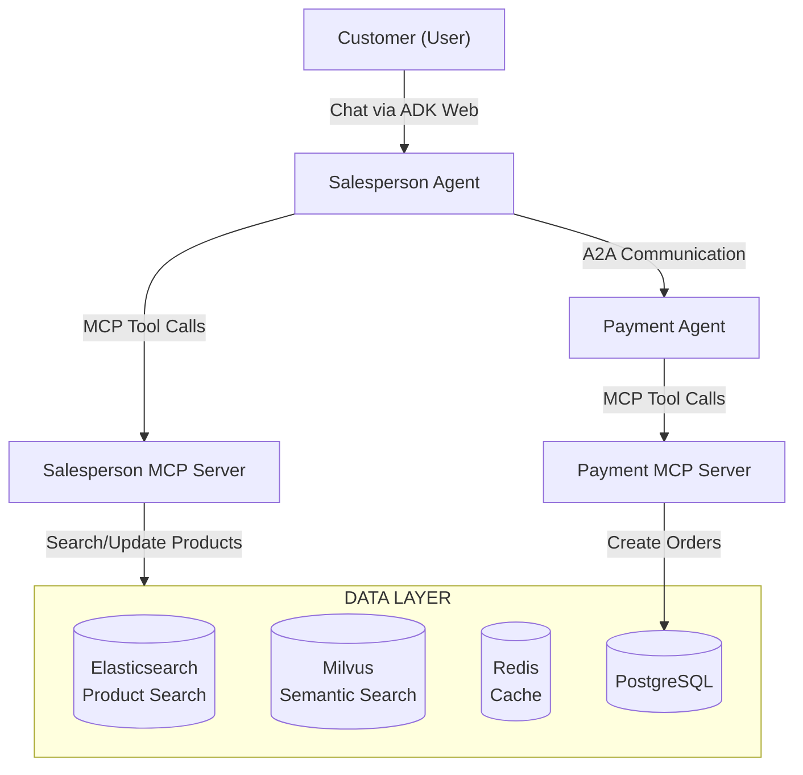
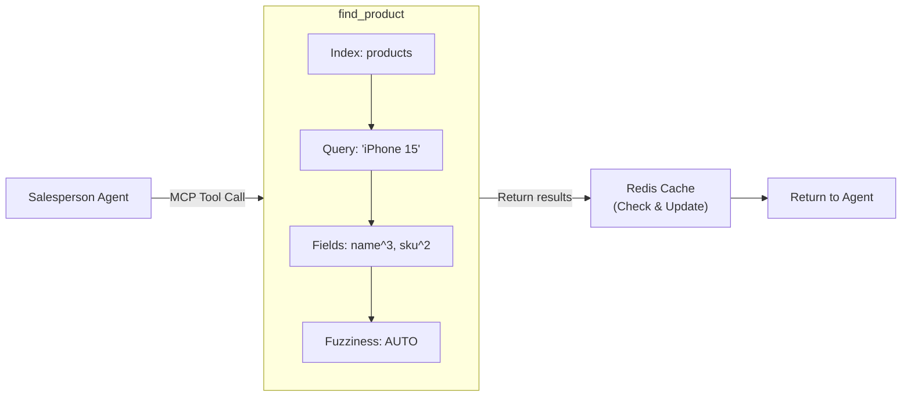
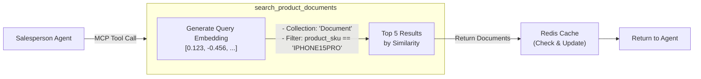
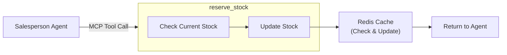
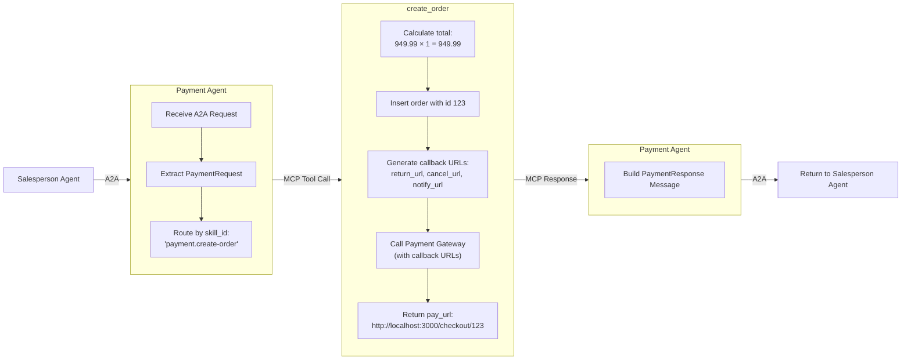
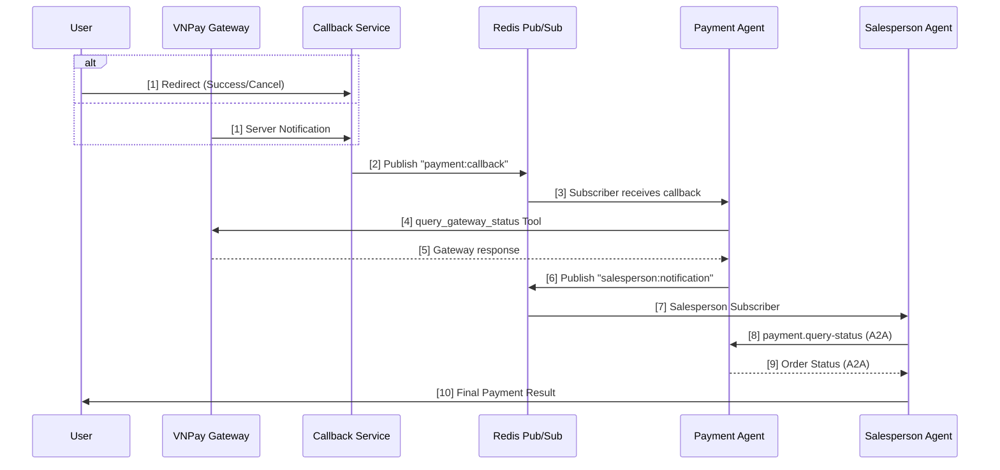
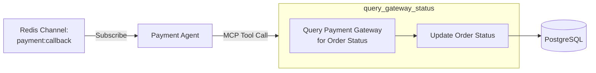

# DEMO SCENARIOS - AGENT ECOSYSTEM: SALESPERSON & PAYMENT

## 📋 MỤC LỤC

1. [Tổng Quan Hệ Thống](#1-tổng-quan-hệ-thống)
2. [Scenario 1: Merchant Workflow](#2-scenario-1-merchant-workflow)
3. [Scenario 2: Customer Purchase Journey](#3-scenario-2-customer-purchase-journey)
4. [API Quick Reference](#4-api-quick-reference)

---

## 1. TỔNG QUAN HỆ THỐNG

### 1.1. Kiến Trúc Tổng Thể



### 1.2. Luồng Dữ Liệu Chi Tiết

#### **Merchant Flow:**


**Đặc điểm:**
- Ghi vào PostgreSQL và Milvus trực tiếp
- Sync tự động sang Elasticsearch mỗi 20 giây

#### **Customer Flow:**


**Đặc điểm:**
- Salesperson Agent gọi Salesperson MCP Server, hoặc gọi Payment Agent qua A2A (JSON-RPC 2.0)
- MCP Server có quyền truy cập trực tiếp toàn bộ Data Layer, nhưng Agent KHÔNG gọi trực tiếp Data Layer

## 2. SCENARIO 1: MERCHANT WORKFLOW

### 2.1. Upload Sản Phẩm Mới

**Endpoint:** `POST http://localhost:8082/webhook/products`

**Use Case:** Merchant thêm sản phẩm iPhone 15 Pro vào hệ thống

**Request:**

```bash
curl -X POST http://localhost:8082/webhook/products \
  -H "Content-Type: application/json" \
  -d '{
    "sku": "IPHONE15PRO",
    "name": "iPhone 15 Pro 256GB Titanium",
    "price": 999.99,
    "currency": "USD",
    "stock": 50,
    "merchant_id": 1
  }'
```

**Response Success (201):**

```json
{
  "status": "00",
  "message": "Product created successfully",
  "data": {
    "sku": "IPHONE15PRO",
    "name": "iPhone 15 Pro 256GB Titanium",
    "price": 999.99,
    "currency": "USD",
    "stock": 50,
    "merchant_id": 1,
    "created_at": "2025-01-15T10:00:00+00:00",
    "updated_at": "2025-01-15T10:00:00+00:00"
  }
}
```

**Response Error - Duplicate (409):**

```json
{
  "status": "01",
  "message": "Product with SKU 'IPHONE15PRO' already exists",
  "data": null
}
```

**Behind the Scenes:**
1. Webhook API nhận request
2. Validate dữ liệu (ProductCreate schema)
3. Ghi trực tiếp vào PostgreSQL:
   ```sql
   INSERT INTO product (sku, name, price, currency, stock, merchant_id)
   VALUES ('IPHONE15PRO', 'iPhone 15 Pro 256GB Titanium', 999.99, 'USD', 50, 1);
   ```
4. Clear Redis cache:
   ```
   DELETE pattern: product:IPHONE15PRO
   DELETE pattern: merchant:1:products:*
   ```
5. Elasticsearch sync tự động chạy sau 20 giây

---

### 2.2. Upload Product Documents (Semantic Search)

**Endpoint:** `POST http://localhost:8082/webhook/documents`

**Use Case:** Merchant upload thông tin chi tiết sản phẩm để hỗ trợ tìm kiếm semantic

**Request - Specifications Chunk:**

```bash
curl -X POST http://localhost:8082/webhook/documents \
  -H "Content-Type: application/json" \
  -d '{
    "text": "iPhone 15 Pro features the powerful A17 Pro chip with 6-core CPU and 6-core GPU. It has a 6.1-inch Super Retina XDR display with ProMotion technology supporting up to 120Hz refresh rate. The device is built with aerospace-grade titanium for strength and lightness.",
    "title": "iPhone 15 Pro - Technical Specifications",
    "product_sku": "IPHONE15PRO",
    "chunk_id": 1,
    "merchant_id": 1
  }'
```

**Request - Camera Features Chunk:**

```bash
curl -X POST http://localhost:8082/webhook/documents \
  -H "Content-Type: application/json" \
  -d '{
    "text": "The iPhone 15 Pro camera system includes a 48MP main camera with second-generation sensor-shift OIS, a 12MP ultra-wide camera with macro photography, and a 12MP 3x telephoto camera. It supports ProRAW and ProRes video recording at up to 4K 60fps with Log encoding.",
    "title": "iPhone 15 Pro - Camera Features",
    "product_sku": "IPHONE15PRO",
    "chunk_id": 2,
    "merchant_id": 1
  }'
```

**Response Success (201):**

```json
{
  "status": "00",
  "message": "Document inserted successfully",
  "data": {
    "id": 1,
    "text": "iPhone 15 Pro features the powerful A17 Pro chip...",
    "title": "iPhone 15 Pro - Technical Specifications",
    "product_sku": "IPHONE15PRO",
    "chunk_id": 1,
    "merchant_id": 1,
    "message": "Document inserted successfully with ID 1"
  }
}
```

**Behind the Scenes:**
1. Webhook API nhận request
2. Validate product_sku tồn tại trong PostgreSQL
3. Generate embedding vector (mock - cần replace production):
   ```python
   embedding = [0.123, -0.456, 0.789, ...] # 384 dimensions
   ```
4. Insert vào Milvus collection "Document":
   ```python
   doc_data = {
     "id": 1,
     "text": "iPhone 15 Pro features...",
     "embedding": [0.123, -0.456, ...],
     "title": "iPhone 15 Pro - Technical Specifications",
     "product_sku": "IPHONE15PRO",
     "chunk_id": 1,
     "merchant_id": 1
   }
   ```

---

## 3. SCENARIO 2: CUSTOMER PURCHASE JOURNEY

### Bước 1: User Tìm Kiếm Sản Phẩm

**User Input:** "Tôi muốn mua iPhone 15 Pro"

**Salesperson Agent Action:** Gọi **Salesperson MCP Server** - Tool: `find_product`

**Internal Flow:**



**Tool Response to Agent:**

```json
{
  "status": "00",
  "data": [
    {
      "sku": "IPHONE15PRO",
      "name": "iPhone 15 Pro 256GB Titanium",
      "price": 949.99,
      "currency": "USD",
      "stock": 30,
      "merchant_id": 1,
      "score": 15.234
    },
    {
      "sku": "SKU0091",
      "name": "iPhone 15 128GB Black",
      "price": 799.99,
      "currency": "USD",
      "stock": 50,
      "merchant_id": 1,
      "score": 12.456
    }
  ]
}
```

**Agent Response to User:**

> "Tôi tìm thấy 2 sản phẩm iPhone 15:
>
> 1. **iPhone 15 Pro 256GB Titanium** - $949.99 (Còn 30 sản phẩm)
> 2. **iPhone 15 128GB Black** - $799.99 (Còn 50 sản phẩm)

---

### Bước 2: User Hỏi Chi Tiết Kỹ Thuật

**User Input:** "Cho tôi biết thông tin về chip A17 Pro"

**Salesperson Agent Action:**



**Tool Response:**

```json
{
  "status": "00",
  "data": [
    {
      "id": 1,
      "text": "iPhone 15 Pro features the powerful A17 Pro chip with 6-core CPU and 6-core GPU. It has a 6.1-inch Super Retina XDR display with ProMotion technology supporting up to 120Hz refresh rate...",
      "title": "iPhone 15 Pro - Technical Specifications",
      "product_sku": "IPHONE15PRO",
      "chunk_id": 1,
      "score": 0.85
    }
  ]
}
```

**Agent Response to User:**

> "iPhone 15 Pro trang bị **chip A17 Pro** mạnh mẽ với:
> - CPU 6 nhân
> - GPU 6 nhân
> - Màn hình Super Retina XDR 6.1 inch với ProMotion (120Hz)

---

### Bước 3: Tính Phí Vận Chuyển

**User Input:** "Phí ship về Hà Nội là bao nhiêu? (100km)"

**Salesperson Agent Action:**

Gọi **Salesperson MCP Server** - Tool: `calc_shipping`

**Parameters:**
- weight: 0.23 kg (iPhone 15 Pro)
- distance: 100 km

**Tool Response:**

```json
{
  "status": "00",
  "data": 55.23
}
```

**Agent Response to User:**

> "Phí vận chuyển đến Hà Nội (100km): **$55.23**

---

### Bước 4: Đặt Hàng - Reserve Stock

**User Input:** "OK, tôi đặt mua 1 chiếc"

**Salesperson Agent Action:**

Gọi **Salesperson MCP Server** - Tool: `reserve_stock`

**Parameters:**
- sku: "IPHONE15PRO"
- quantity: 1

**Internal Flow:**



**Tool Response:**

```json
{
  "status": "00",
  "data": true
}
```

**Agent Response to User:**

> "Đã giữ hàng thành công!
> Bây giờ chúng ta tiến hành thanh toán.
> Bạn muốn thanh toán qua:
> 1. Thẻ tín dụng (redirect)
> 2. QR code (scan qua banking app)"

---

### Bước 5: Checkout - A2A Communication

**User Input:** "Thanh toán qua thẻ tín dụng"

**Salesperson Agent → Payment Agent**: Send A2A Request

**HTTP Request:**

```
POST http://localhost:8081/
Content-Type: application/json
```

**Body (JSON-RPC 2.0):**

```json
{
  "jsonrpc": "2.0",
  "id": "req-abc-123",
  "method": "message.send",
  "params": {
    "message": {
      "message_id": "msg-uuid-1",
      "role": "user",
      "context_id": "payment-550e8400-e29b-41d4-a716-446655440000",
      "parts": [
        {
          "root": {
            "type": "TextPart",
            "text": "Salesperson agent requests payment order creation"
          }
        },
        {
          "root": {
            "type": "DataPart",
            "data": {
              "protocol": "A2A_V1",
              "context_id": "payment-550e8400-e29b-41d4-a716-446655440000",
              "action": "CREATE_ORDER",
              "items": [
                {
                  "sku": "IPHONE15PRO",
                  "name": "iPhone 15 Pro 256GB Titanium",
                  "quantity": 1,
                  "unit_price": 949.99,
                  "currency": "USD"
                }
              ],
              "customer": {
                "name": "John Doe",
                "email": "john@example.com",
                "phone": "+1234567890",
                "shipping_address": "123 Main St, Hanoi"
              },
              "channel": "redirect"
            }
          }
        }
      ]
    },
    "metadata": {
      "task": {
        "metadata": {
          "skill_id": "payment.create-order"
        }
      }
    }
  }
}
```

---

### Payment Agent Processing

**Flow:**



**A2A Response:**

```json
{
  "jsonrpc": "2.0",
  "id": "req-abc-123",
  "result": {
    "message": {
      "role": "agent",
      "parts": [
        {
          "root": {
            "type": "DataPart",
            "data": {
              "context_id": "payment-550e8400-e29b-41d4-a716-446655440000",
              "status": "PENDING",
              "provider_name": "nganluong",
              "order_id": "123",
              "pay_url": "http://localhost:3000/checkout/123",
              "expires_at": "2025-01-15T11:15:00Z",
              "next_action": {
                "type": "REDIRECT",
                "url": "http://localhost:3000/checkout/123"
              }
            }
          }
        }
      ]
    }
  }
}
```

---

### User Redirect to Payment

**Agent Response to User:**

> "✅ Đơn hàng #123 đã được tạo thành công!
>
> **Thông tin đơn hàng:**
> - Sản phẩm: iPhone 15 Pro 256GB Titanium
> - Số lượng: 1
> - Tổng tiền: $949.99
>
> 🔗 [Nhấn vào đây để thanh toán](http://localhost:3000/checkout/123)
>
> (Link có hiệu lực đến 11:15:00)"

**User clicks link → Redirected to payment gateway**

---

### Query Payment Status (After Gateway Callback)

Sau khi user hoàn thành hoặc hủy thanh toán trên cổng thanh toán, hệ thống sẽ tự động thông báo kết quả qua luồng callback.

**Flow Tổng Quan:**



---

#### Bước 1: Payment Gateway Callback

Khi user hoàn thành thanh toán hoặc hủy, Payment Gateway sẽ:

1. **Redirect user** về `return_url` (success) hoặc `cancel_url` (cancel)
2. **Gọi notify_url** để thông báo backend bất đồng bộ

**Callback URLs được tạo khi create order:**
```
return_url: http://localhost:8083/return/vnpay?order_id=123
cancel_url: http://localhost:8083/cancel/vnpay?order_id=123
notify_url: http://localhost:8083/callback/vnpay?order_id=123
```

---

#### Bước 2: Callback Service Xử Lý

**Endpoint:** `GET /callback/vnpay?order_id={order_id}`

Callback Service nhận request và publish message lên Redis:

```python
# Publish to Redis channel "payment:callback"
message = {
    "order_id": "123",
    "timestamp": "2025-01-15T11:20:00+00:00"
}
await redis_client.publish("payment:callback", json.dumps(message))
```

**Response to Gateway:**
```json
{
  "status": "00",
  "message": "Callback received successfully"
}
```

---

#### Bước 3: Payment Agent Xử Lý



**Gateway Query Response:**
```json
{
  "gateway_response": {
    "status": "SUCCESS",
    "transaction_id": "VNP14210123456789",
    "amount": 949.99,
    "currency": "USD",
    "paid_at": "2025-01-15T11:18:30+00:00"
  },
  "order": {
    "id": 123,
    "context_id": "payment-550e8400-e29b-41d4-a716-446655440000",
    "status": "SUCCESS",
    "total_amount": 949.99,
    "currency": "USD"
  }
}
```

---

#### Bước 4: Payment Agent Notify Salesperson Agent

Sau khi xử lý callback, Payment Agent publish notification cho Salesperson Agent:

**Redis Channel:** `salesperson:notification`

**Message Format:** (chỉ chứa order_id và context_id, không có status)
```json
{
  "order_id": "123",
  "context_id": "payment-550e8400-e29b-41d4-a716-446655440000",
  "timestamp": "2025-01-15T11:20:05+00:00"
}
```

**Lưu ý:** Status KHÔNG được gửi trong notification. Salesperson Agent sẽ tự query status qua A2A.

---

#### Bước 5: Salesperson Agent Query Order Status

Salesperson Agent nhận notification từ Redis (chỉ có order_id + context_id), sau đó gọi A2A request đến Payment Agent để lấy **actual status** và chi tiết order:

**A2A Request (JSON-RPC 2.0):**

```json
{
  "jsonrpc": "2.0",
  "id": "req-status-456",
  "method": "message.send",
  "params": {
    "message": {
      "message_id": "msg-uuid-status-1",
      "role": "user",
      "context_id": "payment-550e8400-e29b-41d4-a716-446655440000",
      "parts": [
        {
          "root": {
            "type": "TextPart",
            "text": "Query payment status for context_id"
          }
        },
        {
          "root": {
            "type": "DataPart",
            "data": {
              "protocol": "A2A_V1",
              "context_id": "payment-550e8400-e29b-41d4-a716-446655440000",
              "order_id": "123",
              "from_agent": "salesperson_agent",
              "to_agent": "payment_agent",
              "action": "QUERY_STATUS"
            }
          }
        }
      ]
    },
    "metadata": {
      "task": {
        "metadata": {
          "skill_id": "payment.query-status"
        }
      }
    }
  }
}
```

**A2A Response (Success):**

```json
{
  "jsonrpc": "2.0",
  "id": "req-status-456",
  "result": {
    "message": {
      "role": "agent",
      "parts": [
        {
          "root": {
            "type": "DataPart",
            "data": {
              "context_id": "payment-550e8400-e29b-41d4-a716-446655440000",
              "status": "SUCCESS",
              "provider_name": "vnpay",
              "order_id": "123",
              "transaction_id": "VNP14210123456789",
              "order": {
                "id": 123,
                "context_id": "payment-550e8400-e29b-41d4-a716-446655440000",
                "total_amount": 949.99,
                "currency": "USD",
                "status": "SUCCESS",
                "items": [
                  {
                    "product_sku": "IPHONE15PRO",
                    "product_name": "iPhone 15 Pro 256GB Titanium",
                    "quantity": 1,
                    "unit_price": 949.99
                  }
                ],
                "created_at": "2025-01-15T11:00:00+00:00",
                "updated_at": "2025-01-15T11:20:05+00:00"
              },
              "next_action": {
                "type": "NONE"
              }
            }
          }
        }
      ]
    }
  }
}
```

---

#### Kết Quả: Agent Response to User

**Case 1: Thanh toán thành công**

**User returns via:** `http://localhost:3000/return?cid=payment-550e8400-...`

**Agent Response to User:**

> "🎉 **Thanh toán thành công!**
>
> **Chi tiết đơn hàng #123:**
> - Sản phẩm: iPhone 15 Pro 256GB Titanium
> - Số lượng: 1
> - Tổng tiền: $949.99
> - Mã giao dịch: VNP14210123456789
> - Trạng thái: ✅ Đã thanh toán
> - Địa chỉ giao hàng: 123 Main St, Hanoi
>
> Cảm ơn bạn đã mua hàng! 🙏"

---

**Case 2: Thanh toán bị hủy**

**User returns via:** `http://localhost:3000/cancel?cid=payment-550e8400-...`

**A2A Response (Cancelled):**

```json
{
  "jsonrpc": "2.0",
  "id": "req-status-789",
  "result": {
    "message": {
      "role": "agent",
      "parts": [
        {
          "root": {
            "type": "DataPart",
            "data": {
              "context_id": "payment-550e8400-e29b-41d4-a716-446655440000",
              "status": "CANCELLED",
              "provider_name": "vnpay",
              "order_id": "123",
              "order": {
                "id": 123,
                "status": "CANCELLED",
                "total_amount": 949.99,
                "currency": "USD"
              },
              "next_action": {
                "type": "ASK_USER",
                "message": "Payment was cancelled. Would you like to try again?"
              }
            }
          }
        }
      ]
    }
  }
}
```

**Agent Response to User:**

> "❌ **Thanh toán đã bị hủy**
>
> **Đơn hàng #123:**
> - Sản phẩm: iPhone 15 Pro 256GB Titanium
> - Số lượng: 1
> - Tổng tiền: $949.99
> - Trạng thái: 🚫 Đã hủy
>
> Bạn có muốn thử thanh toán lại không? Tôi có thể tạo link thanh toán mới cho bạn."

---

## 4. API QUICK REFERENCE

### 4.1. Webhook API (Merchant Portal)

**Base URL:** `http://localhost:8082`

| Endpoint | Method | Description | Body |
|----------|--------|-------------|------|
| `/webhook/products` | POST | Create product | ProductCreate |
| `/webhook/products` | GET | List products | Query: `merchant_id` |
| `/webhook/products/{sku}` | GET | Get product | Query: `merchant_id` |
| `/webhook/products/{sku}` | PUT | Update product | ProductUpdate |
| `/webhook/products/{sku}` | DELETE | Delete product | Query: `merchant_id` |
| `/webhook/documents` | POST | Upload document | DocumentCreate |

### 4.2. Payment Agent A2A

**Base URL:** `http://localhost:8081`

| Endpoint | Method | Description |
|----------|--------|-------------|
| `/.well-known/agent-card.json` | GET | Agent discovery |
| `/` | POST | Send task (JSON-RPC) |

**Skills:**
- `payment.create-order` - Create payment order
- `payment.query-status` - Query order status

### 4.3. MCP Servers

#### Salesperson MCP

**Tools:**
- `find_product` - Search products (Elasticsearch)
- `calc_shipping` - Calculate shipping cost
- `reserve_stock` - Reserve inventory
- `search_product_documents` - Semantic search (Milvus)

#### Payment MCP

**Tools:**
- `create_order` - Create payment order
- `query_order_status` - Query order status
- `query_gateway_status` - Query payment gateway status
