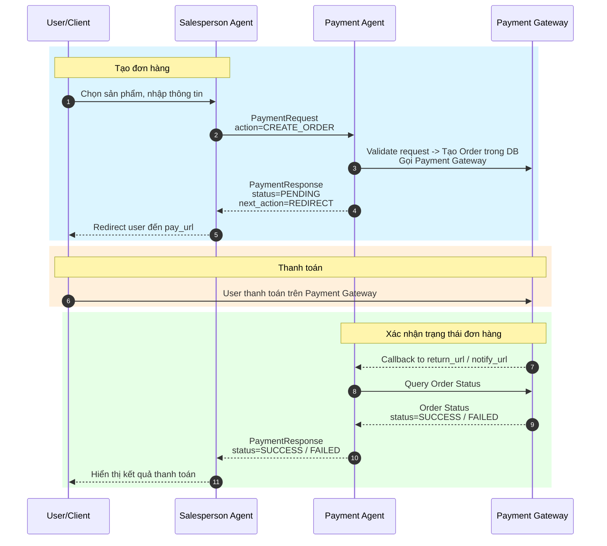

# A2A (Agent-to-Agent) Payment Workflow

## Overview

Hệ thống sử dụng giao thức A2A để giao tiếp giữa **Salesperson Agent** và **Payment Agent** trong quá trình xử lý thanh toán.

---

## Schemas

### 1. Enums

| Enum | Giá trị | Mô tả |
|------|---------|-------|
| **PaymentStatus** | `PENDING`, `SUCCESS`, `FAILED`, `CANCELLED` | Trạng thái thanh toán |
| **PaymentChannel** | `redirect`, `qr` | Kênh thanh toán |
| **NextActionType** | `NONE`, `ASK_USER`, `REDIRECT`, `SHOW_QR` | Hành động tiếp theo |
| **PaymentAction** | `CREATE_ORDER`, `QUERY_STATUS`, `CANCEL` | Loại action |
| **PaymentMethodType** | `PAYGATE` | Loại phương thức thanh toán |
| **ProtocolVersion** | `A2A_V1` | Phiên bản giao thức |

---

### 2. PaymentRequest

Yêu cầu thanh toán từ Salesperson Agent gửi đến Payment Agent.

**Ví dụ:**
```json
{
    "protocol": "A2A_V1",
    "context_id": "sale-abc-123",
    "from_agent": "salesperson_agent",
    "to_agent": "payment_agent",
    "action": "CREATE_ORDER",
    "items": [
        {
            "sku": "SKU001",
            "name": "iPhone 15 Pro",
            "quantity": 1,
            "unit_price": 999.99,
            "currency": "USD"
        }
    ],
    "customer": {
        "name": "Nguyen Van A",
        "email": "a@example.com",
        "phone": "+84123456789",
        "shipping_address": "123 ABC Street, HCM City"
    },
    "method": {
        "type": "PAYGATE",
        "channel": "redirect",
        "return_url": "https://shop.com/payment/return",
        "cancel_url": "https://shop.com/payment/cancel"
    }
}
```

---

### 3. PaymentResponse

Phản hồi từ Payment Agent trả về cho Salesperson Agent.

**Ví dụ (Redirect Channel):**
```json
{
    "context_id": "sale-abc-123",
    "status": "PENDING",
    "provider_name": "nganluong",
    "order_id": "ORD-12345",
    "pay_url": "https://checkout.nganluong.vn/pay/ORD-12345",
    "qr_code_url": null,
    "expires_at": "2024-01-15T10:30:00Z",
    "next_action": {
        "type": "REDIRECT",
        "url": "https://checkout.nganluong.vn/pay/ORD-12345",
        "expires_at": "2024-01-15T10:30:00Z"
    }
}
```

**Ví dụ (QR Channel):**
```json
{
    "context_id": "sale-abc-456",
    "status": "PENDING",
    "provider_name": "vnpay",
    "order_id": "ORD-67890",
    "pay_url": null,
    "qr_code_url": "https://qr.vnpay.vn/ORD-67890.png",
    "expires_at": "2024-01-15T10:30:00Z",
    "next_action": {
        "type": "SHOW_QR",
        "qr_code_url": "https://qr.vnpay.vn/ORD-67890.png",
        "expires_at": "2024-01-15T10:30:00Z"
    }
}
```

---

## Workflow

