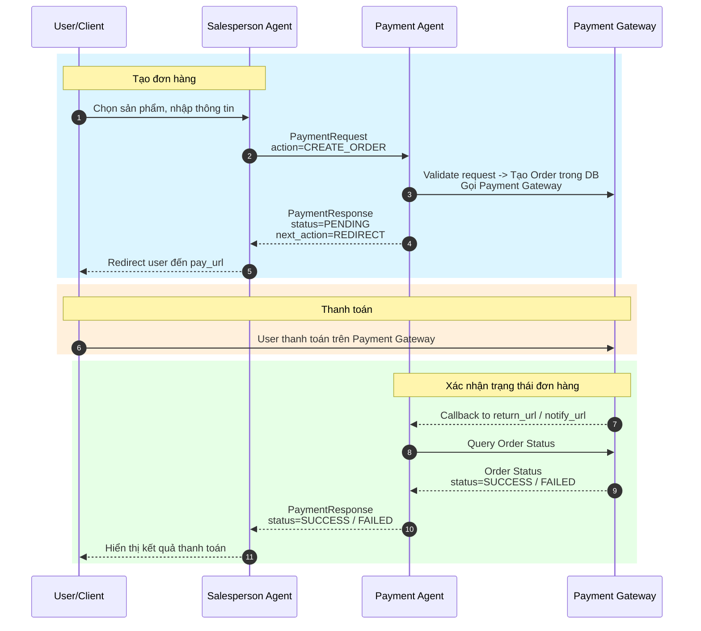

# A2A (Agent-to-Agent) Payment Workflow

## Overview

Hệ thống sử dụng giao thức A2A để giao tiếp giữa **Salesperson Agent** và **Payment Agent** trong quá trình xử lý thanh toán.

---

## Enum

| Enum | Giá trị | Mô tả |
|------|---------|-------|
| **PaymentStatus** | `PENDING`, `SUCCESS`, `FAILED`, `CANCELLED` | Trạng thái thanh toán |
| **PaymentChannel** | `redirect`, `qr` | Kênh thanh toán |
| **NextActionType** | `NONE`, `ASK_USER`, `REDIRECT`, `SHOW_QR` | Hành động tiếp theo |
| **PaymentAction** | `CREATE_ORDER`, `QUERY_STATUS`, `CANCEL` | Loại action |
| **PaymentMethodType** | `PAYGATE` | Loại phương thức thanh toán |
| **ProtocolVersion** | `A2A_V1` | Phiên bản giao thức |

---

## Workflow

