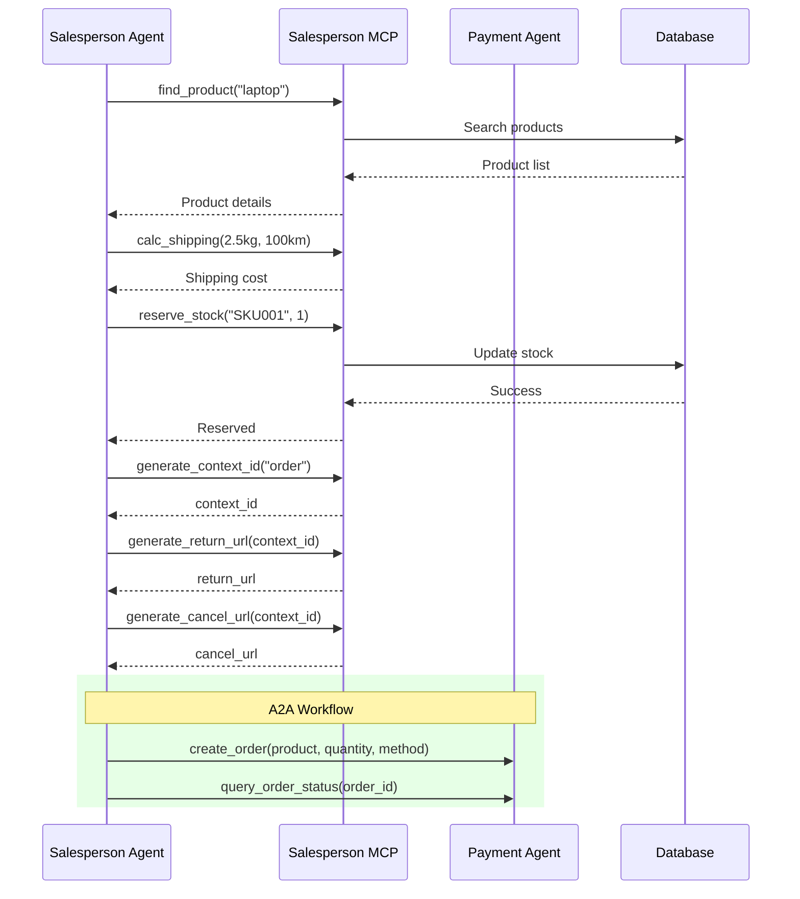

# MCP Workflow Documentation

## Overview

The system consists of two main MCP servers:

1. **Payment MCP Server** - Handles payment order operations
2. **Salesperson MCP Server** - Manages product search, inventory, and payment context generation

---

## Architecture

### Core Components

#### 1. MCP Connection Parameters (`mcp_connect_params.py`)
Provides connection parameter builders for MCP clients:

- **SSE Connection**: `get_mcp_sse_connect_params(url, token)`
  - SSE read timeout: 120 seconds
  - Connection timeout: 30 seconds
  - Bearer token authentication

- **Streamable HTTP Connection**: `get_mcp_streamable_http_connect_params(url, token)`
  - Connection timeout: 30 seconds
  - Bearer token authentication

#### 2. Utility Functions (`utils.py`)
- **`list_mcp_tools_with_dict(tool_lists)`**: Converts ADK tools to MCP tool format
- **`call_mcp_tool_with_dict(name, arguments, tool_lists)`**: Executes ADK tools and returns MCP content

#### 3. Logging Middleware (`logging_middleware.py`)
HTTP middleware that logs all requests/responses with:
- Request details (IP, URL, method, headers, body)
- Response details (status, headers, body)
- Authorization token masking
- Body truncation for large payloads (max 4096 bytes for logging)

#### 4. App Context Middleware (`app_context_middleware.py`)
Sets logger context for each request:
- Payment MCP: `AppLogger.PAYMENT_MCP`
- Salesperson MCP: `AppLogger.SALESPERSON_MCP`

---

## Payment MCP Server

### Server Configuration
- **Server Name**: `payment_mcp`
- **Port**: Configured via `MCP_SERVER_PORT_PAYMENT`
- **Transport**: Streamable HTTP
- **Endpoint**: `/mcp`

### Available Tools

#### 1. `create_order`
Creates a payment order and saves it to the database.

**Parameters**:
```json
{
  "product_sku": "SKU001",
  "quantity": 1,
  "user_id": 123,  
  "method": {
    "channel": "redirect|qr",
    "return_url": "https://...", 
    "cancel_url": "https://..."   
  }
}
```

**Workflow**:
1. Retrieve product information from database by SKU
2. Calculate total amount (price × quantity)
3. Create order record with status `PENDING`
4. Call payment gateway stub to generate payment URL/QR code
5. Build `NextAction` response based on payment channel:
   - **REDIRECT**: Returns payment URL with expiration
   - **QR**: Returns QR code URL with expiration
6. Return `PaymentResponse` with order details

**Returns**:
```json
{
  "status": "success",
  "data": {
    "context_id": "123",
    "status": "pending",
    "provider_name": "PayGate",
    "order_id": "123",
    "pay_url": "https://checkout.example.com/123",
    "qr_code_url": "https://qr.example.com/123.png",
    "expires_at": "2025-11-24T12:00:00Z",
    "next_action": {
      "type": "redirect|show_qr",
      "url": "...",
      "qr_code_url": "...",
      "expires_at": "..."
    }
  }
}
```

#### 2. `query_order_status`
Queries the current status of an order.

**Parameters**:
```json
{
  "order_id": "123"
}
```

**Workflow**:
1. Validate order_id format (must be integer)
2. Query order from database
3. Map order status to payment status
4. Return order details with current status

**Returns**:
```json
{
  "status": "success",
  "data": {
    "context_id": "123",
    "status": "pending|success|failed|cancelled",
    "order_id": "123",
    "order": {
      "id": 123,
      "user_id": 456,
      "product_sku": "SKU001",
      "quantity": 1,
      "total_amount": 99.99,
      "currency": "USD",
      "status": "pending"
    }
  }
}
```

**Workflow**:
1. Validate order_id format (must be integer)
2. Retrieve order from database
3. Validate new status value against `OrderStatus` enum
4. Update order status and commit transaction
5. Return updated order details

**Returns**:
```json
{
  "status": "success",
  "data": {
    "id": 123,
    "status": "paid",
    "updated_at": "..."
  }
}
```

---

## Salesperson MCP Server

### Server Configuration
- **Server Name**: `salesperson_mcp`
- **Port**: Configured via `MCP_SERVER_PORT_SALESPERSON`
- **Transport**: Streamable HTTP
- **Endpoint**: `/mcp`

### Background Tasks
- **Product Sync**: Syncs products from PostgreSQL to Elasticsearch every 20 seconds
  + Checks if Elasticsearch index exists
  + Creates index if missing
  + Syncs all product data

### Available Tools

#### 1. `find_product`
Searches for products by SKU or product name substring.

**Parameters**:
```json
{
  "query": "laptop"
}
```

**Workflow**:
1. Convert query to lowercase
2. Search in Elasticsearch using text matching
3. Return matching products

**Returns**:
```json
{
  "status": "success",
  "data": [
    {
      "sku": "SKU001",
      "name": "Gaming Laptop",
      "price": 1299.99,
      "stock": 15
    }
  ]
}
```

#### 2. `calc_shipping`
Calculates shipping cost based on weight and distance.

**Parameters**:
```json
{
  "weight": 2.5,    
  "distance": 100   
}
```

**Returns**:
```json
{
  "status": "success",
  "data": 57.5
}
```

#### 3. `reserve_stock`
Reserves inventory for a product.

**Parameters**:
```json
{
  "sku": "SKU001",
  "quantity": 2
}
```

**Workflow**:
1. Find product by SKU (bypass cache)
2. Check if product exists
3. Validate sufficient stock available
4. Reduce stock by quantity
5. Update database

**Returns**:
```json
{
  "status": "success",
  "data": true
}
```

#### 4. `generate_context_id`
Generates a unique correlation ID for tracking payment requests.

**Parameters**:
```json
{
  "prefix": "order"
}
```

**Returns**:
```json
{
  "status": "success",
  "data": "order-550e8400-e29b-41d4-a716-446655440000"
}
```

#### 5. `generate_return_url`
Builds the return URL for payment gateway redirects.

**Parameters**:
```json
{
  "context_id": "order-550e8400-..."
}
```

**Returns**:
```json
{
  "status": "success",
  "data": "https://return.example.com?cid=order-550e8400-..."
}
```

#### 6. `generate_cancel_url`
Builds the cancel URL for payment gateway redirects.

**Parameters**:
```json
{
  "context_id": "order-550e8400-..."
}
```

**Returns**:
```json
{
  "status": "success",
  "data": "https://cancel.example.com?cid=order-550e8400-..."
}
```

#### 7. `search_product_documents`
Searches product documentation in vector database (Milvus).

**Parameters**:
```json
{
  "query": "how to install",
  "product_sku": "SKU001",  
  "limit": 5              
}
```

**Workflow**:
1. Check Redis cache for existing results
2. If cache miss:
   - Generate query embedding using OpenAI text-embedding-ada-002
   - Search Milvus vector database
   - Filter by product_sku if provided
   - Extract document chunks with similarity scores
   - Cache results in Redis with TTL
3. Return matching documents

**Returns**:
```json
{
  "status": "success",
  "data": [
    {
      "id": 1,
      "text": "Installation guide...",
      "title": "Getting Started",
      "product_sku": "SKU001",
      "chunk_id": 0,
      "score": 0.95
    }
  ]
}
```

**Caching**:
- Cache key pattern: `vector_search:{query}:{product_sku}:{limit}`
- TTL: `TTL.VECTOR_SEARCH` (configured in cache settings)

---

## Workflow

